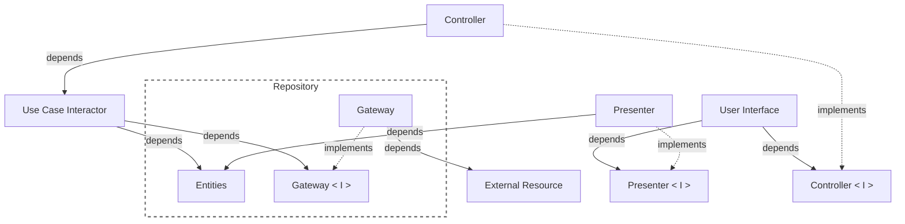
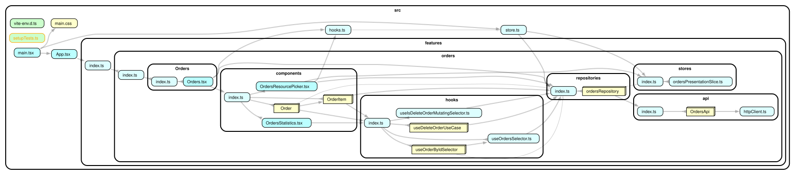

# Clean Reactive Architecture — React Sample

A sample application that demonstrates
[Clean Reactive Architecture](https://github.com/clean-reactive/documentation/blob/main/docs/architecture.md)
implemented with React.

The sample shows a concrete, working mapping of every architectural unit from
the diagram to idiomatic React code.

> :bulb: **Architecture reference implementation.** `components/Order` keeps its presenter, controller, and use case separate so the architecture is visible. Simpler components inline their units. This is a demonstration choice, not a rule that every component must follow. See the [Development Methodology](https://github.com/clean-reactive/documentation/blob/main/docs/methodology.md).

> :bulb: **Multiple data resources.** The repository accesses either an in-memory resource or a remote API through the same gateway contract. This demonstrates substituting resource implementations without changing the consuming units. Multiple resources and runtime switching are included for demonstration purposes, not required by the architecture.

<details>
<summary><b>Watch the demo</b></summary>

<!-- Add the demo video link here. -->

</details>

## Getting started

Install dependencies:

```sh
npm ci
```

Start the development server:

```sh
npm run dev
```

## Tech stack

- [React](https://react.dev/) 18
- [Redux Toolkit](https://redux-toolkit.js.org/) + [RTK Query](https://redux-toolkit.js.org/rtk-query/overview)
- [TypeScript](https://www.typescriptlang.org/)
- [Vite](https://vitejs.dev/)
- [Tailwind CSS](https://tailwindcss.com/) + [daisyUI](https://daisyui.com/)
- [Vitest](https://vitest.dev/) + [Testing Library](https://testing-library.com/)
- [MSW](https://mswjs.io/) for network-level HTTP interception in gateway tests
- [dependency-cruiser](https://github.com/sverweij/dependency-cruiser) for dependency validation and graph visualization

## Architecture mapping

The table below shows how each unit from the Clean Reactive Architecture diagram
maps to this codebase. Locations are relative to `src/features/orders`.

| Architectural unit              | React / RTK equivalent                 | Location                                                                                                |
| ------------------------------- | -------------------------------------- | ------------------------------------------------------------------------------------------------------- |
| Application business entity     | Redux slice (`createSlice`)            | `stores/ordersPresentationSlice.ts`                                                                     |
| Enterprise business entity      | TypeScript type                        | `repositories/ordersRepository/ordersRepository.types.ts`                                               |
| Gateway interface               | TypeScript interface                   | `OrdersGateway` in `repositories/ordersRepository/ordersRepository.types.ts`                            |
| Repository (gateway + entities) | RTK Query API (`createApi`)            | `repositories/ordersRepository/ordersRepository.ts`                                                     |
| Gateway implementation          | Factory returning `OrdersGateway`      | `repositories/ordersRepository/OrdersService/`                                                          |
| Use case interactor             | React hook or inline operation         | `hooks/useDeleteOrderUseCase`, `components/OrderItem/OrderItem.tsx`                                     |
| Selector                        | React hook                             | `hooks/useOrdersSelector.ts`, `hooks/useOrderByIdSelector`, `hooks/useIsDeleteOrderMutatingSelector.ts` |
| Presenter                       | React hook or inline projection        | `components/Order/hooks/usePresenter`, inline in simpler components                                     |
| ViewModel                       | Plain values prepared by the presenter | `Presenter` in `components/Order/Order.types.ts`                                                        |
| Controller                      | React hook or inline event handlers    | `components/Order/hooks/useController.ts`, inline in simpler components                                 |
| User interface                  | React component                        | `Orders`, `components/Order`, `components/OrderItem`                                                    |

## Key design decisions

These decisions are specific to this sample, guided by its demonstration goals
and the capabilities of React and the selected libraries. The architecture
defines responsibilities and boundaries without prescribing specific technical
solutions.

**Extracted units as React hooks.** Extracted units in this sample are
implemented as React hooks composed by components. `Order` deliberately
extracts its presenter, controller, use case, and selectors so the full
architecture is visible. Simpler components inline units without independent
policy or reuse.

**Component functions as composition roots.** A component function composes the
units used by its JSX and wires their dependencies through hooks.

**Self-contained React components.** Components own their view-facing behavior
and resolve their data within their composition boundary. Their props are
limited to identity or configuration parameters, such as `orderId` and
`itemId`, rather than receiving entity data through props. This is a deliberate
demonstration choice to reduce structural coupling, not a mandatory rule.

**Application business entity as a Redux slice.** `OrdersPresentationEntity`
holds application-level state (`ordersResource: "local" | "remote"`) that
persists across use case calls and has its own rules. It is managed by a
dedicated Redux slice, not by RTK Query.

**Repository as RTK Query `createApi`.** `ordersRepository` combines gateway
access and observable entity state. It consumes `OrdersGateway`, exposes query
and mutation operations, and manages the entity cache and optimistic updates.

**Gateway selection at runtime.** `makeOrdersService(resource)` returns either
`makeInMemoryOrdersService()` or `makeRemoteOrdersService()` according to
`ordersResource`. The repository calls this factory inside each endpoint. The
resource picker changes that state and resets the query cache to load the
selected resource.

**Hooks for reactive state.** RTK Query and React Redux hooks subscribe to data
and operation state. `usePresenter` projects that state into plain values for
JSX.

## UML diagram representing application architecture


<details>
  <summary>mermaid</summary>



</details>

## Folder structure

```console
src/features
└── orders
    ├── api                         # external resource (HTTP client + API)
    ├── components                  # user interface, presenters, controllers
    │   ├── Order
    │   │   ├── hooks
    │   │   │   ├── useController.ts
    │   │   │   └── usePresenter
    │   │   │       └── usePresenter.ts
    │   │   ├── Order.tsx
    │   │   └── Order.types.ts
    │   ├── OrderItem
    │   │   └── OrderItem.tsx        # inline presenter, controller, use case
    │   ├── OrdersResourcePicker.tsx
    │   └── OrdersStatistics.tsx
    ├── hooks                       # use cases, selectors
    │   ├── useDeleteOrderUseCase
    │   │   └── useDeleteOrderUseCase.ts
    │   ├── useIsDeleteOrderMutatingSelector.ts
    │   ├── useOrderByIdSelector
    │   │   └── useOrderByIdSelector.ts
    │   └── useOrdersSelector.ts
    ├── Orders
    │   └── Orders.tsx              # user interface + inline presenter
    ├── repositories                # repository, gateway interface, gateway implementations
    │   └── ordersRepository
    │       ├── ordersRepository.ts
    │       ├── ordersRepository.types.ts
    │       ├── ordersRepository.utils.ts
    │       └── OrdersService       # resource selection + gateway implementations
    ├── stores                      # application business entity
    │   ├── OrdersPresentationEntity.types.ts
    │   └── ordersPresentationSlice.ts
    ├── testIds.ts
    └── utils
        └── isOrdersResource.ts
```

## Further reading

- [Clean Reactive Architecture](https://github.com/clean-reactive/documentation/blob/main/docs/architecture.md)
- [Development Methodology](https://github.com/clean-reactive/documentation/blob/main/docs/methodology.md)

## Dependency graph


